# Getting your machine ready for Xamarin developement

At Microsoft Build 2017, Microsoft unveiled the brand new Visual Studio for Mac-available now (see what's new [here](https://channel9.msdn.com/Events/Build/2017/P4187)). To develop and deploy Xamarin apps to the platform of your choice, you now have two options available to you on Mac. Blow are instructions on how to get started on Xamarin Studio and Visual Studio for Mac. 

NOTE: You only need to install one or the other. No need to install both.

# Xamarin Studio - Installation on Mac

Welcome. This guide will assist users running <b> Mac </b> install Xamarin Studio Community with the tools nessecary for Xamarin.  If you are on a Windows, follow the guide [here](https://github.com/NZMSA/2017-Phase-1/tree/master/Installation%20Windows)

# Prerequisites

- 	Device running Mac (either OS X El Capitan (10.11) or macOS Sierra (10.12))
-	Latest version of Xcode

# Install

1. Download Xamarin Studio Community Installer from https://www.xamarin.com/download.

2. Open the installer. You will be presented with a lot of options. For MSA right now, leave everything selected and click 'Continue'.

3. Select where you like to install Xamarin and click 'Continue'.

4. Click 'Install' and let it do its thing. This may take awhile depending on your internet connection. You may be prompted during the installation to enter your admin password so be ready for that.

# Install Xcode

Xamarin Studio does not include the iOS simulator and will not deploy to an iOS device without first downloading and installing Xcode.

1. Download Xcode through either the App Store and searching for 'Xcode' or by navigating to https://itunes.apple.com/nz/app/xcode/id497799835?mt=12

 

 # Create Project

1.  Open Xamarin Studio

2. Select 'New Solution...'

3. Under Multiplatform > App > Forms App and click 'Next'.

 

4. Give your app a name. Make sure 'Android' and 'iOS' are checked. We want 'Use Protable Class Library' selected. 'Use XAML for user interface files should also be checked. Click 'Next' when you're done.	

5. Edit the project name and solution name to whatever you like or leave it as it is. If you want to change the location the project is saved to this is where you do it. Click 'Create' when you're done.

This will create a blank Xamarin project for you. Deploy it and check it out!

<b> IMPORTANT STEP </b> For Module One, you need to change the UI to display your name somewhere.

# Visual Studio 2017 for Mac

Welcome. This guide will assist users running <b> Mac </b> install Visual Studio 2017 Community with the tools nessecary for Xamarin.  If you are on a Windows, follow the guide [here](https://github.com/NZMSA/2017-Phase-1/tree/master/Installation%20Windows)

# Prerequisites

<table>
<tbody>

<tr>
<td>Supported Operating Systems</td>
<td>
Visual Studio 2017 for Mac will install and run on the following operating systems: 

- macOS Sierra 10.12: Community, Professional, and Enterprise.
- Mac OS X El Capitan 10.11: Community, Professional, and Enterprise*.

 *the latest version of Xcode 8.3 requires macOS Sierra 10.12, therefore Xamarin.iOS and Xamarin.Mac projects also require that minimum version
</td>
</tr>

<tr>
<td>Hardware</td>
<td>

* 1.8 GHz or faster processor. Dual-core or better recommended.
* 4 GB of RAM; 8 GB of RAM recommended (4 GB minimum if running on a virtual machine).
* Hard disk space: approx 1GB.
</td>
</tr>

<tr>
<td>Additional Requirements</td>
<td>

* .NET Core SDK 1.1 is required to use .NET Core projects and features. It can be [downloaded and installed](https://aka.ms/vs/mac/install-netcore) separately, and requires Mac OS X El Capitan 10.11 or higher.
* Xamarin.Android requires the 64-bit Java Development Kit (JDK).
* Xamarin.iOS requires Apple's Xcode IDE and iOS SDK.
* Xamarin.Forms can target both Android and iOS platforms, given the requirements listed above.
</td>
</tr>

</tbody>

</table>

# Install

1. Download Visual Studio 2017 Community Installer from https://www.visualstudio.com/vs/visual-studio-mac/.

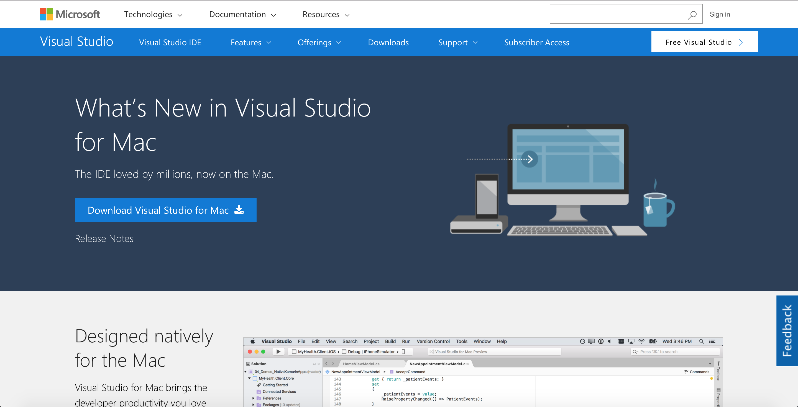

2. Open the installer. You will be presented with a lot of options. For MSA right now, leave everything selected and click 'Install'.

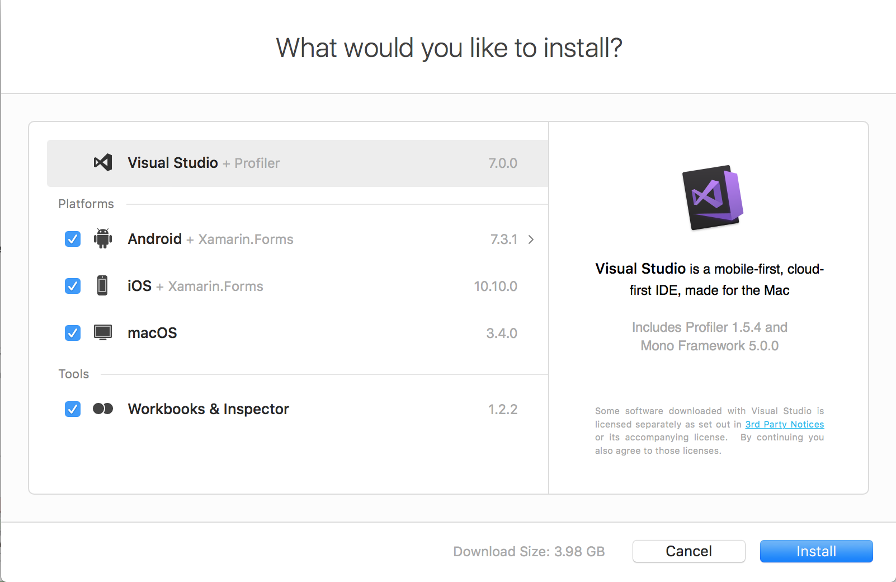

3. Once Visual Studio has finished installing, click 'Start Visual Studio'.

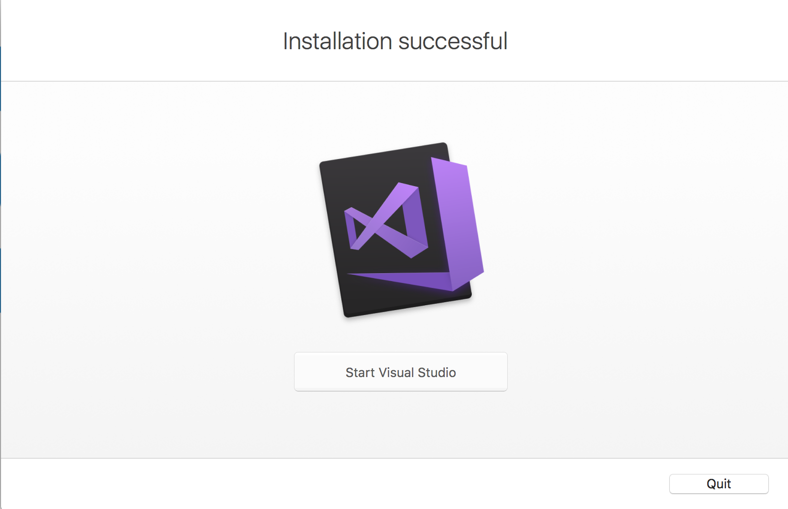

# Install Xcode

Just like Xamarin Studio, Visual Studio does not include the iOS simulator and you will not deploy to an iOS device without first downloading and installing Xcode.

1. Download Xcode through either the App Store and searching for 'Xcode' or by navigating to https://itunes.apple.com/nz/app/xcode/id497799835?mt=12

 

# Updating Visual Studtio

Once Visual Studio has finsihed installing and you've opened it up for the first time, you should see something like this.

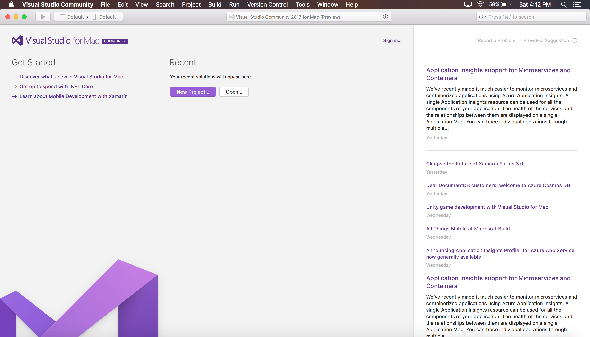

1. To update first click 'Visual Studio Community' -> 'Check for Updates...'

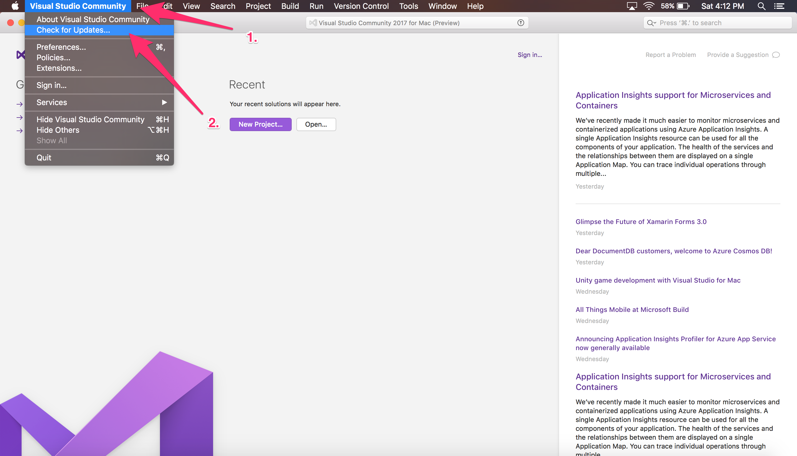

2. You'll then see a popup window with various packages beginning to download. Leave it as it is until it has finished downloading. You may need to enter your password from time to time during the installation process. Once completed, Visual Studio will then restart. Check for updates again until there are no new updates left to download.

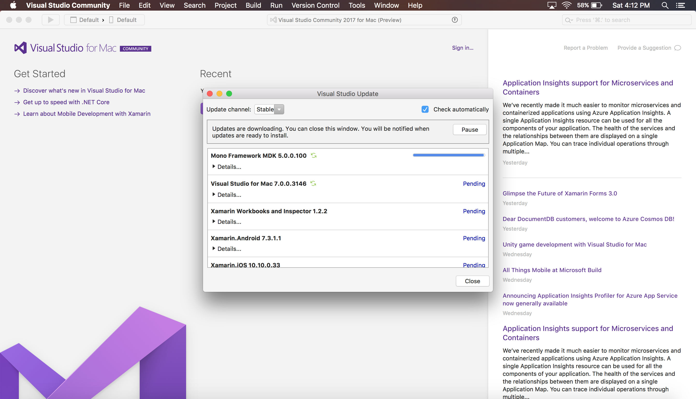

# Create Project

1. Click on 'New Project...'

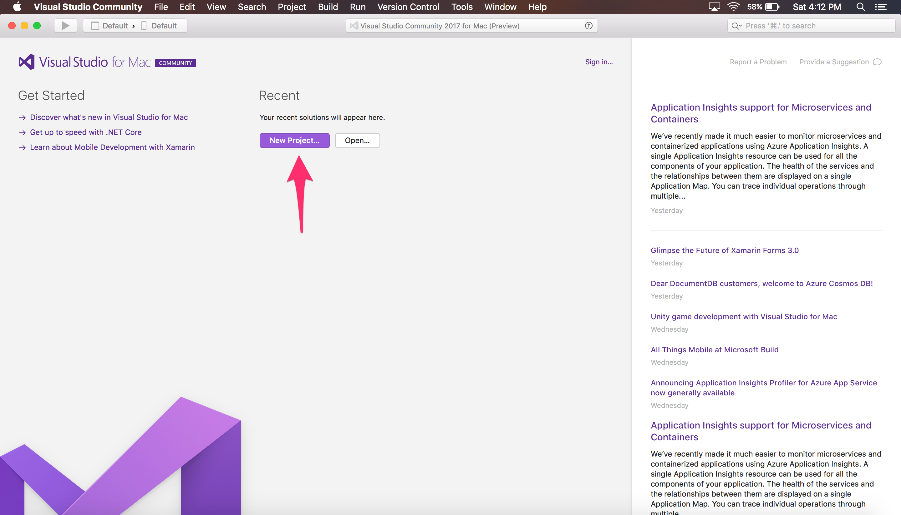

2. Select 'App' -> 'Blank Forms App'.

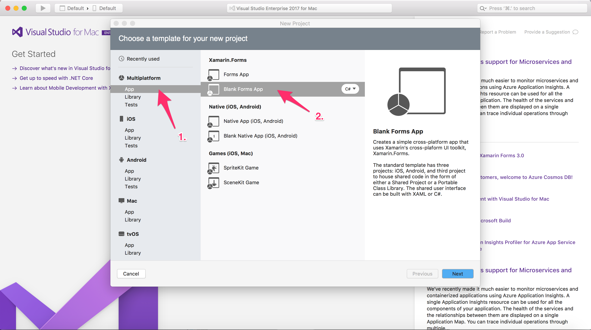

3. Give your app a name, make sure you have 'Android' and 'iOS' enabled, you're using 'Portable Class Library' and 'Use XAML for user interface files' checked.

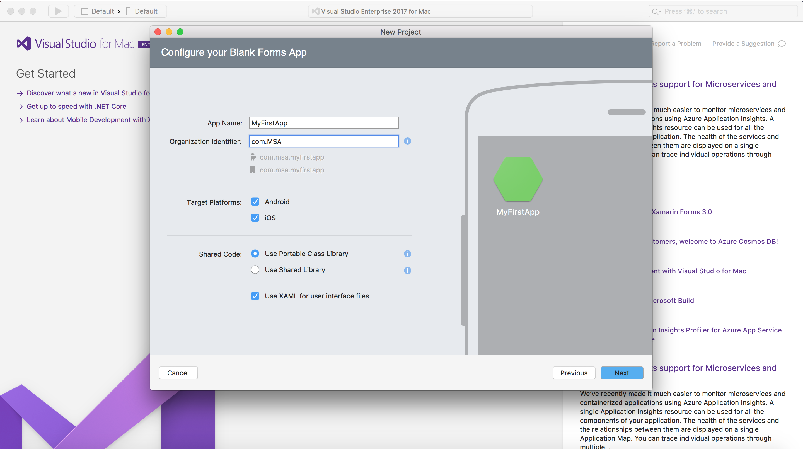

4. Select where you want to save the project and leave everything else as it is. Click 'Create' when you're done.

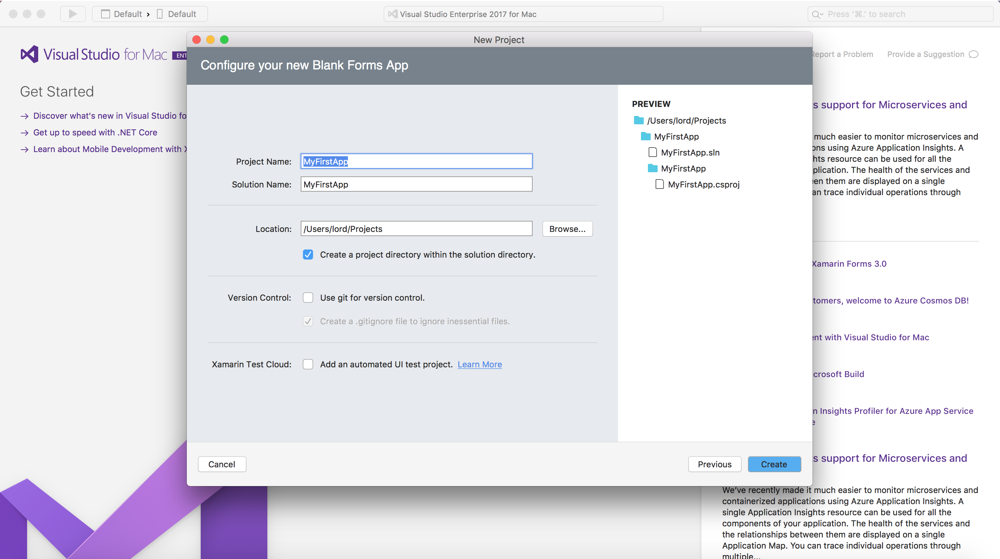

5. Now you're ready to begin developing your first Xamarin application!

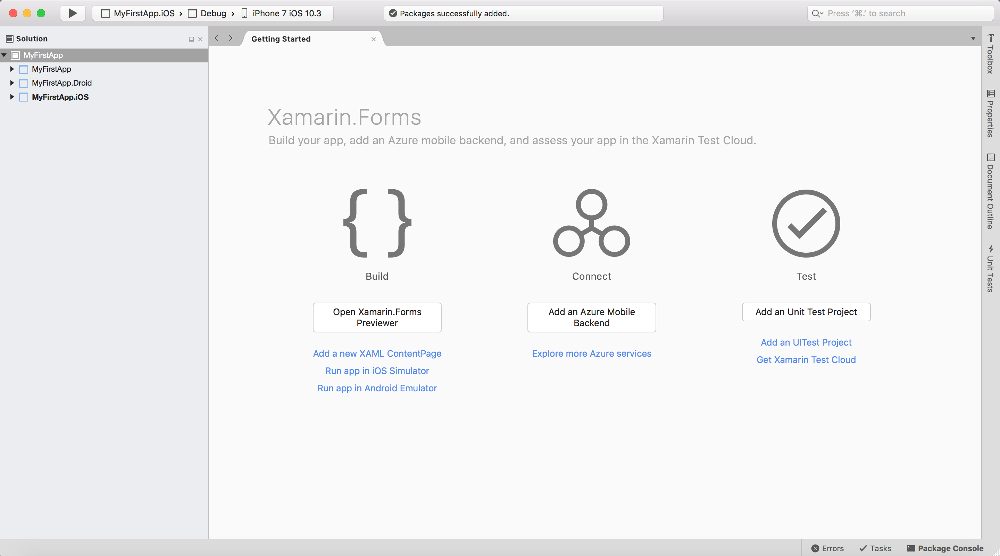

# Deploy It

It's now time to actually run your app! A screenshot of this is required for module one.