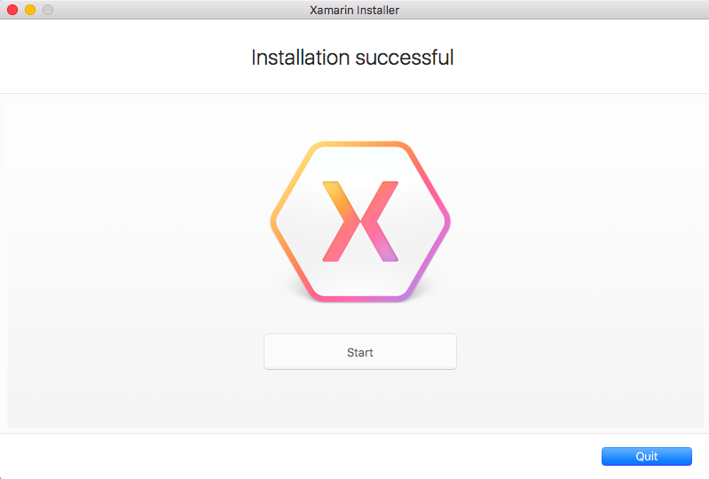
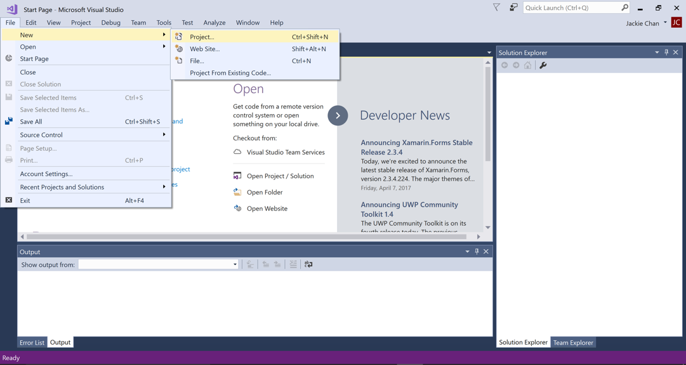
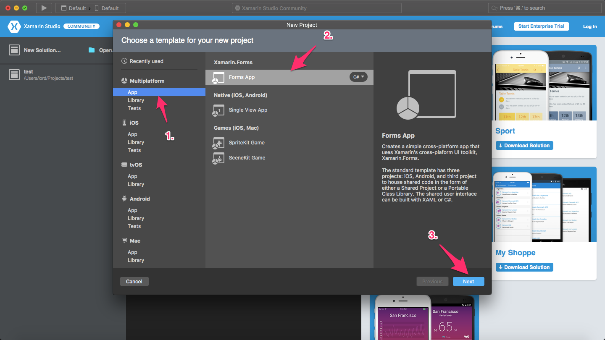
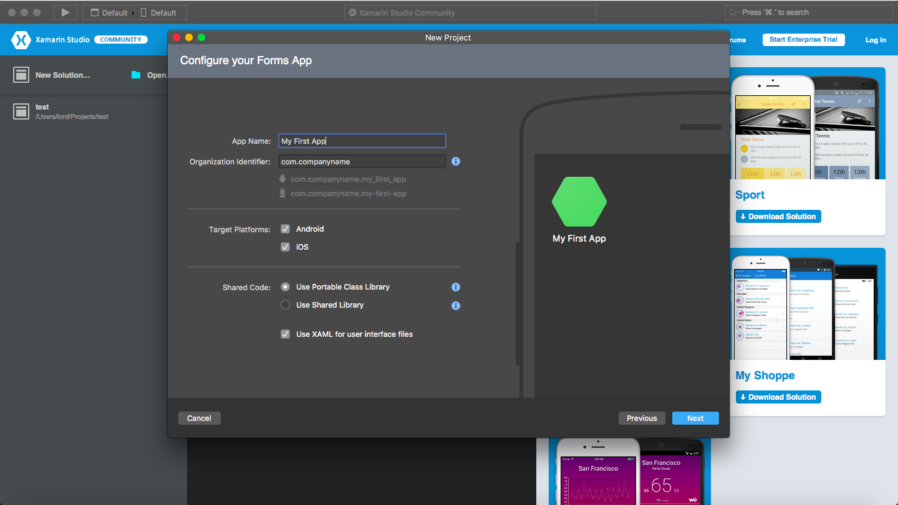
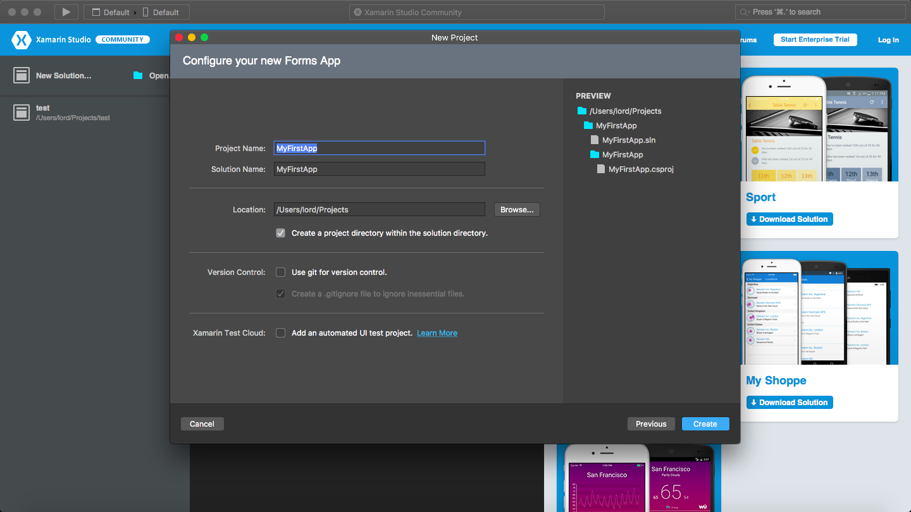

# Xamarin Studio - Installation on Mac

Welcome. This guide will assist users running <b> Mac </b> install Xamarin Studio Community with the tools nessecary for Xamarin.  If you are on a Windows, follow the guide [here](https://github.com/NZMSA/2017-Phase-1/tree/master/Installation%20Windows)

# Prerequisites

- 	Device running Mac (either OS X El Capitan (10.11) or macOS Sierra (10.12))
-	Latest version of Xcode

# Install

1. Download Xamarin Studio Community Installer from https://www.xamarin.com/download.

2. Open the installer. You will be presented with a lot of options. For MSA right now, leave everything selected and click 'Continue'.

3. Select where you like to install Xamarin and click 'Continue'.

4. Click 'Install' and let it do its thing. This may take awhile depending on your internet connection. You may be prompted during the installation to enter your admin password so be ready for that.

# Install Xcode

Xamarin Studio does not include the iOS simulator and will not deploy to an iOS device without first downloading and installing Xcode.

1. Download Xcode through either the App Store and searching for 'Xcode' or by navigating to https://itunes.apple.com/nz/app/xcode/id497799835?mt=12

 

 # Create Project

1.  Open Xamarin Studio

2. Select 'New Solution...'

3. Under Multiplatform > App > Forms App and click 'Next'.

 

4. Give your app a name. Make sure 'Android' and 'iOS' are checked. We want 'Use Protable Class Library' selected. 'Use XAML for user interface files should also be checked. Click 'Next' when you're done.	

5. Edit the project name and solution name to whatever you like or leave it as it is. If you want to change the location the project is saved to this is where you do it. Click 'Create' when you're done.

This will create a blank Xamarin project for you. Deploy it and check it out!

<b> IMPORTANT STEP </b> For Module One, you need to change the UI to display your name somewhere. 

# Deploy It

It's now time to actually run your app! A screenshot of this is required for module one.