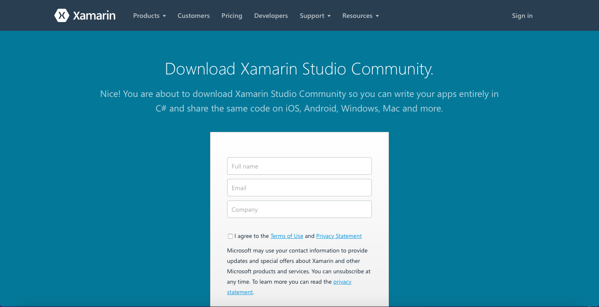
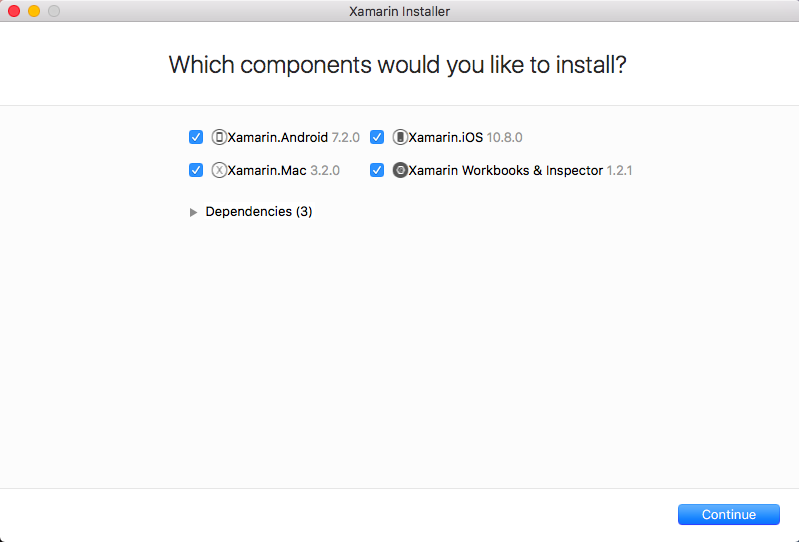
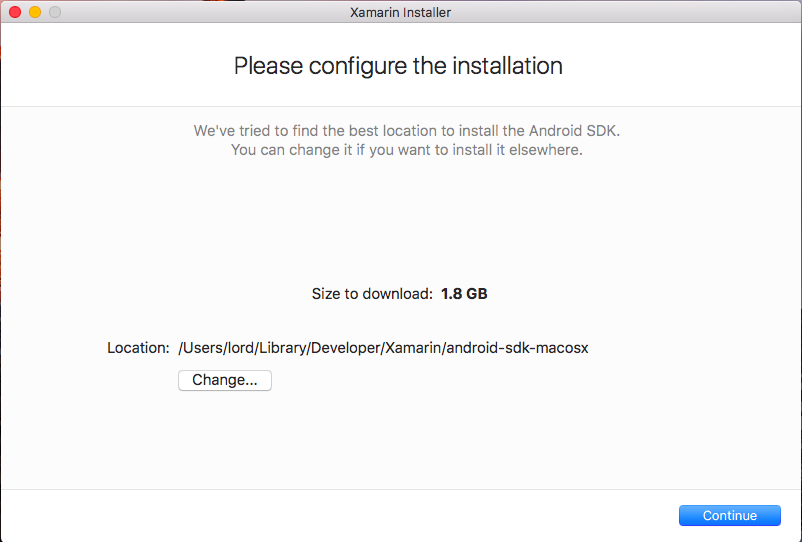
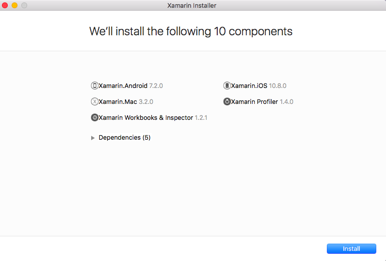
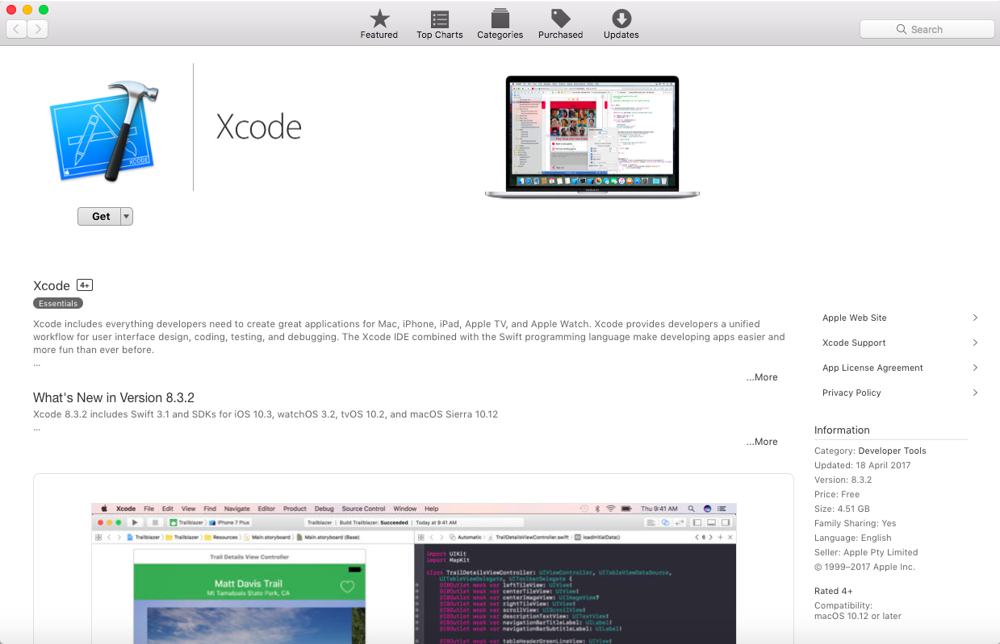

# Xamarin Studio - Installation on Mac

Welcome. This guide will assist users running <b> Mac </b> install Xamarin Studio Community with the tools nessecary for Xamarin.  If you are on a Windows, follow the guide [here](https://github.com/NZMSA/2017-Phase-1/tree/master/Installation%20Windows)

# Prerequisites

- 	Device running Mac (either OS X El Capitan (10.11) or macOS Sierra (10.12))
-	Latest version of Xcode

# Install

1. Download Xamarin Studio Community Installer from https://www.xamarin.com/download.

2. Open the installer. You will be presented with a lot of options. For MSA right now, leave everything selected and click 'Continue'.

3. Select where you like to install Xamarin and click 'Continue'.

4. Click 'Install' and let it do its thing. This may take awhile depending on your internet connection. You may be prompted during the installation to enter your admin password so be ready for that.

# Install Xcode

1. Download Xcode through either the App Store and searching for 'Xcode' or by navigating to https://itunes.apple.com/nz/app/xcode/id497799835?mt=12

 