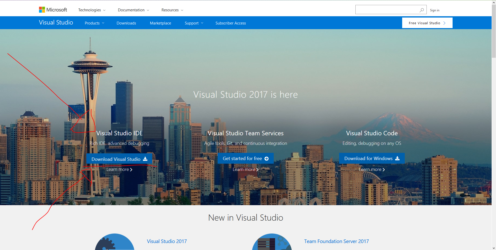
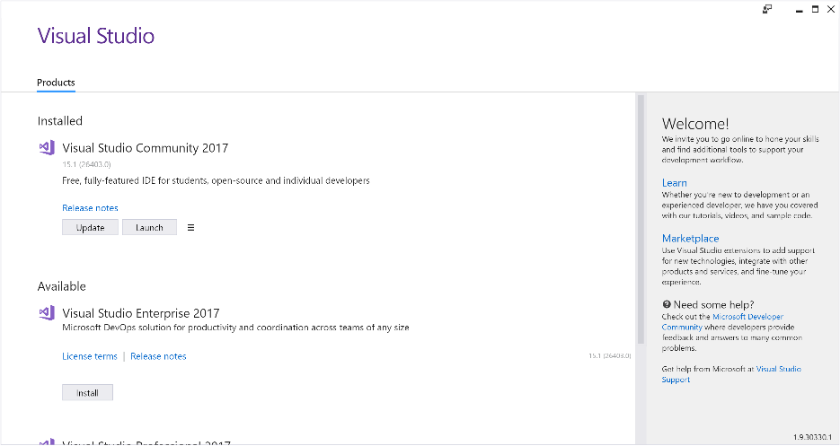

# Visual Studio 2017 - Installation with Xamarin

Welcome. This guide will assist users running <b> Windows </b> install Visual Studio 2017 Community with the tools nessecary for Xamarin and Azure.  If you are on a Mac, follow the guide [here](https://github.com/NZMSA/2017-Phase-1/tree/master/Installation%20Mac)

# A Complete Walk-through Tutorial

This video will walk you through how to complete module one as well as creating a simple game using Xamarin.

<a href="https://www.youtube.com/watch?v=gm-RgfdaISU&t" target="_blank">

</a>

# Prerequisites

- 	Device running Windows 10 (Any Version)
-	30GB of available space

# Install

1. Download Visual Studio Community Installer from https://www.visualstudio.com/.

2. Open the installer. You will be presented with a lot of options. For MSA right now, select "Xamarin Cross Platform" and "Azure Development".

3. Select "Install" and wait for it to finish.

# Create Project

1.  Open Visual Studio 2017

2. Select File > New Project

3. Under Installed > Templates > Visual C#, select ‘Cross Platform App (Xamrin.Forms or Native)’ and click OK.

 

4. Check the boxes ‘Xamrin.Forms’ and ‘Portable Class Library(PCL)’ then click OK. 	

This will create a blank Xamarin project for you. Deploy it and check it out!

<b> IMPORTANT STEP </b> For Module One, you need to change the UI to display your name somewhere. 

# Deploy It

It's now time to actually run your app! A screenshot of this is required for module one.

